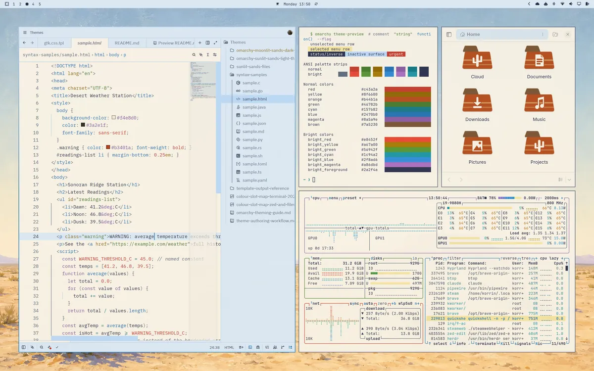
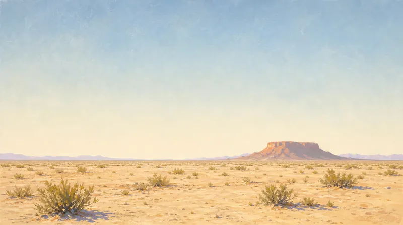
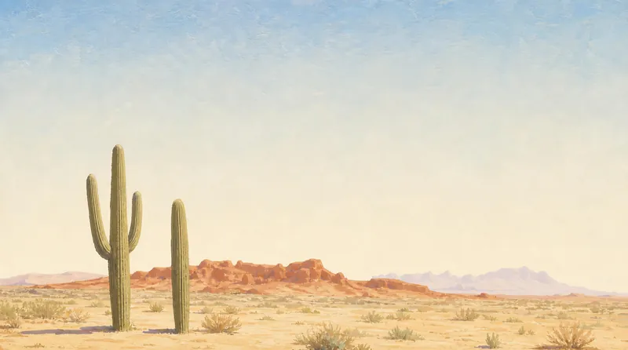
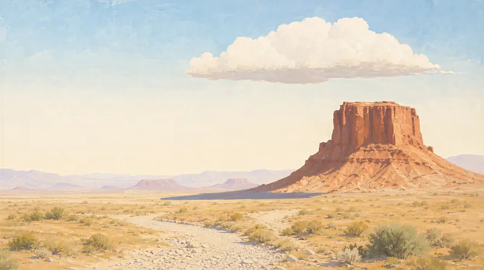
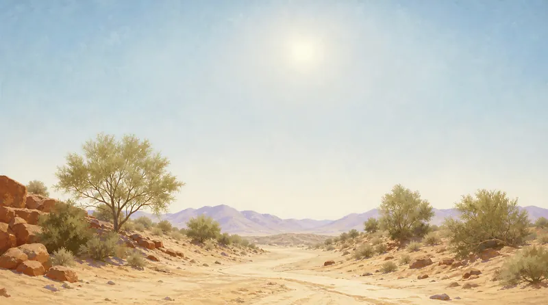
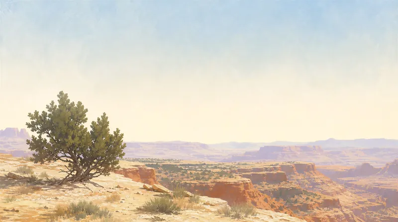
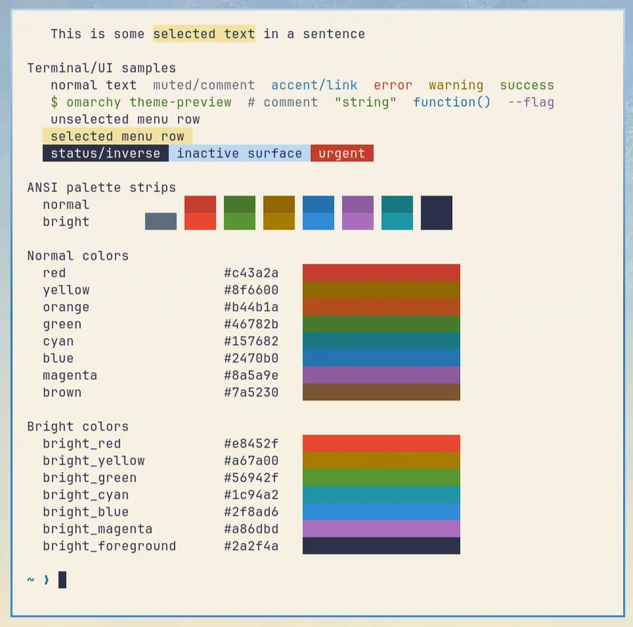
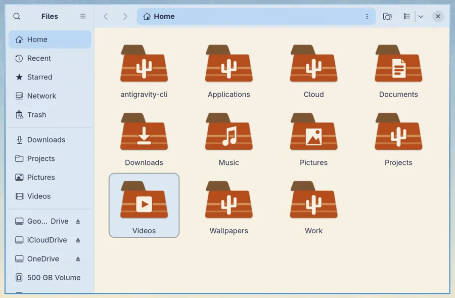
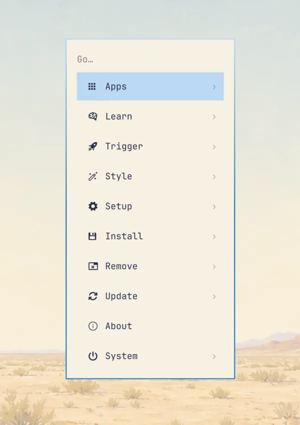
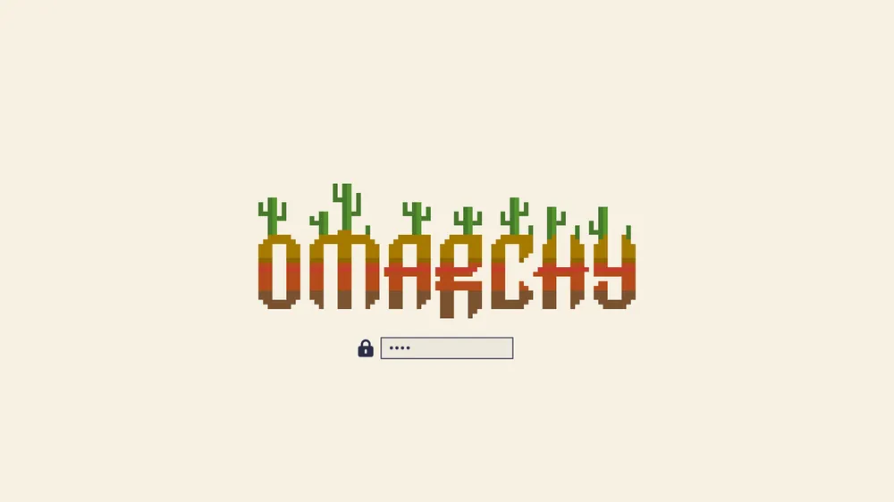

# Sunlit Sands

An [Omarchy](https://omarchy.org) theme. A warm sand page under a cool sky, for working in daylight. Inspired by the sunlit sands of the Arizona Desert. Theme contains optional extras including custom folder icons and app templates that require additional configuration (see below). A dark companion, Moonlit Sands, is in the works.



## Install

```
omarchy theme install https://github.com/Korrin-F/omarchy-sunlit-sands-theme
```

Or in Omarchy: Super+Space, then Install > Style > Theme and paste the URL above.

It installs as `sunlit-sands`.

> [!NOTE]
> Not all theme elements are installed fully by this method, if you are interested in a fuller theme, including custom folder icons and more apps that have been customised for this theme, then see the full list of instructions below to install the rest.

## Wallpapers

Six scenes depicting the Arizona Desert at high noon. Painted in the same flat gouache style. Featuring bright bleached skies and sunlit sands. They are calm enough to keep the bar readable even in transparent mode.

<p>
  
  
  
</p>
<p>
  
  
  
</p>

## Theme Details

The page is warm sand and the panels are cool sky; that temperature contrast is what reads as sunlight. Selection is gold, the accent is sky cerulean, and the terminal palette leans on terracotta, ochre and sage reflecting the colors of the desert at high noon.

<p>
  
  
</p>

Left: the full palette in the terminal.
Right: Files with the theme's custom folder icons. All folders are of a terracotta mesa. The icon on plain folders is a saguaro cactus, native to the Sonoran Desert.

<p>
  
  
</p>

Left: the Omarchy menu, sand coloured card with a sky border in a gradient. 
Right: the boot and disk-unlock screen, the Omarchy wordmark in five warm bands in the style of a terracotta mesa with saguaro cacti growing out of the letters. 

## What is Themed?

Everything Omarchy themes as standard, plus hand-tuned files for the Omarchy shell (bar, menus, notifications), btop, Helix, Obsidian, VS Code, Chromium and Brave, Claude Code and Pi, so those apps get the same sand page and sky panels instead of a generic conversion.

As with any Omarchy theme, a few apps need one step to activate the theme for the first time:

- Obsidian: Settings > Appearance > Themes > Manage, choose "Omarchy".
- Claude Code: run `omarchy-theme-set-claude --activate` once.
- Pi: run `omarchy-theme-set-pi --activate` once.
- Chromium or Brave: restart the browser.

## Optional extras

Omarchy themes an app by filling a template with the palette on every theme change, and it lets you add your own templates for apps it has not covered yet. This theme's `extra-templates/` folder holds two such templates, for GTK apps (such as the file manager) and for Zed.
Omarchy does not read that folder on its own, so each one takes a single paste: copy the template into Omarchy's user-templates folder, then link the file it produces to where the app looks (instructions are below). The custom folder icons work the same way but need a small script instead of a template. 

### Files and other GTK apps

Gives Files (Nautilus) and other GTK4 apps the sand page, sky sidebar and gold selection instead of GTK's default look. Paste this once:

```
mkdir -p ~/.config/omarchy/themed ~/.config/gtk-4.0
cp ~/.config/omarchy/themes/sunlit-sands/extra-templates/gtk.css.tpl ~/.config/omarchy/themed/
ln -sfn ~/.local/state/omarchy/current/theme/gtk.css ~/.config/gtk-4.0/gtk.css
omarchy theme refresh
```

Reopen Files to see it. The template follows whichever theme is active, so it keeps working if you switch themes. If you already had a `~/.config/gtk-4.0/gtk.css` of your own, this replaces it.

To undo: `rm ~/.config/omarchy/themed/gtk.css.tpl ~/.config/gtk-4.0/gtk.css`

### Zed

Gives Zed the same sand page, sky chrome and gold selection as the other editors. Paste this once, then pick "Omarchy" in Zed's theme picker (Ctrl+K then Ctrl+T):

```
cp ~/.config/omarchy/themes/sunlit-sands/extra-templates/zed.json.tpl ~/.config/omarchy/themed/
mkdir -p ~/.config/zed/themes
ln -sfn ~/.local/state/omarchy/current/theme/zed.json ~/.config/zed/themes/omarchy.json
omarchy theme refresh
```

Zed reloads it live and follows every theme change from then on. If Omarchy installed Zed for you, it also installed omazed, which keeps offering its own "Omazed" theme in the picker; the two do not interfere.

To undo: `rm ~/.config/omarchy/themed/zed.json.tpl ~/.config/zed/themes/omarchy.json` and pick another theme in Zed.

### Mesa folder icons

Folder icons drawn for this theme: terracotta mesas with a saguaro on the plain folder. The theme installs with Yaru-sage folders, which Omarchy already ships. This hook links the mesa set into place and selects it after every theme change. Paste this once:

```
mkdir -p ~/.config/omarchy/hooks/theme-set.d
cat > ~/.config/omarchy/hooks/theme-set.d/link-theme-icons <<'EOF'
#!/bin/bash
# Omarchy runs every script in this folder after a theme is applied or refreshed,
# passing the theme's name as $1. This one asks: does the theme that was just
# applied ship an icon set? Omarchy copies a theme's extra-icons/ folder into
# the live theme directory untouched, so the answer is on disk. If a set is
# there, link it where GTK looks and select it. Themes without one are left
# exactly as Omarchy set them from their icons.theme.
#
# An icon set is any folder holding an index.theme; its folder name must match
# the Name= line inside (the normal convention). Written for the Sunlit Sands
# theme, 2026-09-10; the README of that theme tells installers to copy this in.
set -euo pipefail
theme_dir=$HOME/.local/state/omarchy/current/theme
icons_dir=$HOME/.local/share/icons
mkdir -p "$icons_dir"

# Drop links we made for a previous theme that no longer resolve.
for link in "$icons_dir"/*; do
  [[ -L $link && ! -e $link ]] && rm -f "$link"
done

shopt -s nullglob
for index in "$theme_dir"/extra-icons/*/index.theme; do
  set_dir=$(dirname "$index")
  name=$(basename "$set_dir")
  ln -sfn "$set_dir" "$icons_dir/$name"
  gsettings set org.gnome.desktop.interface icon-theme "$name"
  exit 0
done
EOF
omarchy theme refresh
```

The hook is generic: any theme that ships an `extra-icons/<Name>/index.theme` folder gets its icons selected, and themes without one are left as Omarchy set them.

To undo: `rm ~/.config/omarchy/hooks/theme-set.d/link-theme-icons ~/.local/share/icons/Sunlit-Sands` then `omarchy theme refresh`

## Credits and licence

The configuration files and templates are by Korrin-F under the MIT licence (see `LICENSE`). The artwork is by Korrin-F under Creative Commons Attribution-NonCommercial 4.0 (see `LICENSE-ARTWORK`): the six wallpapers, the folder icon set, the boot-screen logo and the screenshots. Credit Korrin-F when you use it; commercial use needs permission. The boot-screen logo is built on the Omarchy wordmark, copyright David Heinemeier Hansson, MIT licence.
